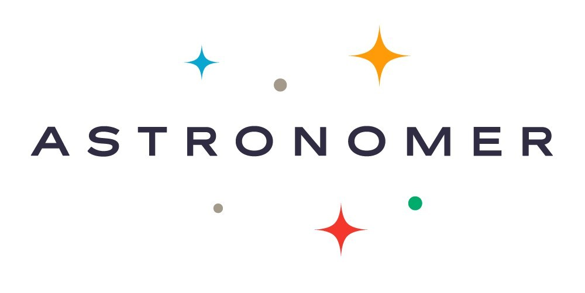

## Quick comparison of managed Airflow offers

|Parameters| MWAA  |  GCP Cloud Composer | Astronomer | Apache Airflow on K8s  |
|:---           | :---      | -------------|          ---:  |---:  |
|Logo|| |||
| Executor      | MWAA supports Celery Executor and Kubernetes Executor(i.e with EKS)| Celery Executor |Astronomer lets you use the Local, Celery and Kubernetes executors|Airflow with K8s uses Kubernetes Executor|
|Ease Of Set-Up |Easy | Easy  | Moderate| Additional Setup of K8s and skill set of K8s required|
|Cost| Costly compare to On Demand Setup [read more ](https://aws.amazon.com/managed-workflows-for-apache-airflow/pricing/)| Costly compare to On Demand Setup [read more](https://cloud.google.com/composer/pricing)| Costly compare to On Demand Setup  [read more](https://medium.com/apache-airflow/managed-apache-airflow-c361f4c8a4e1)|free and opersource, only instances charges are paid, No software services are charged|
|Configurable|Less, we can't change the docker image of airflow|Less compare to on demand and astronomer|Highly configurable compared with AWS and GCP|All in our hands|
|Security |Good, SSO Login|Good|Good|Depends on our setup
|Auto scaling|Yes|Yes|Yes|Yes|
|Dag Sync|S3 bucket only| - | - |S3, Git-sync, multiple options available|
|Resource Limitation (max how many worker nodes available)||||Based on our K8s setup we can achieve max capabilities of airflow|
|Reliable|Yes|Yes|Yes|No|
